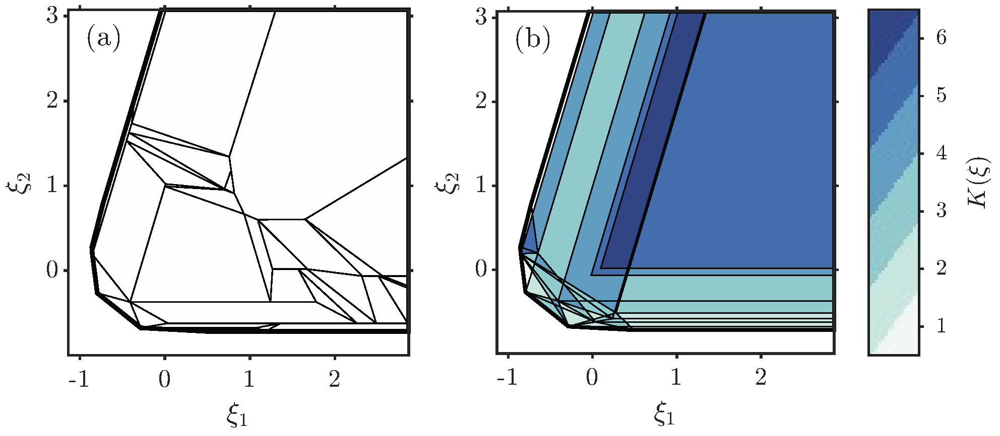
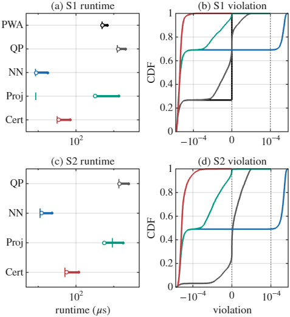
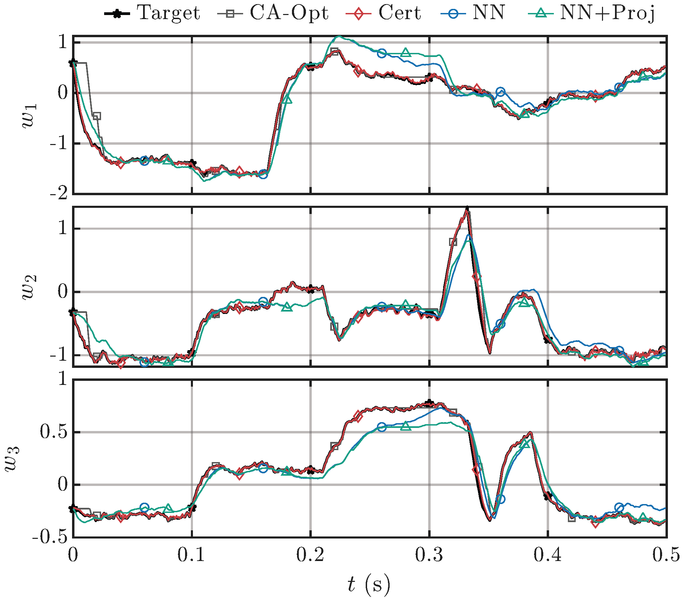
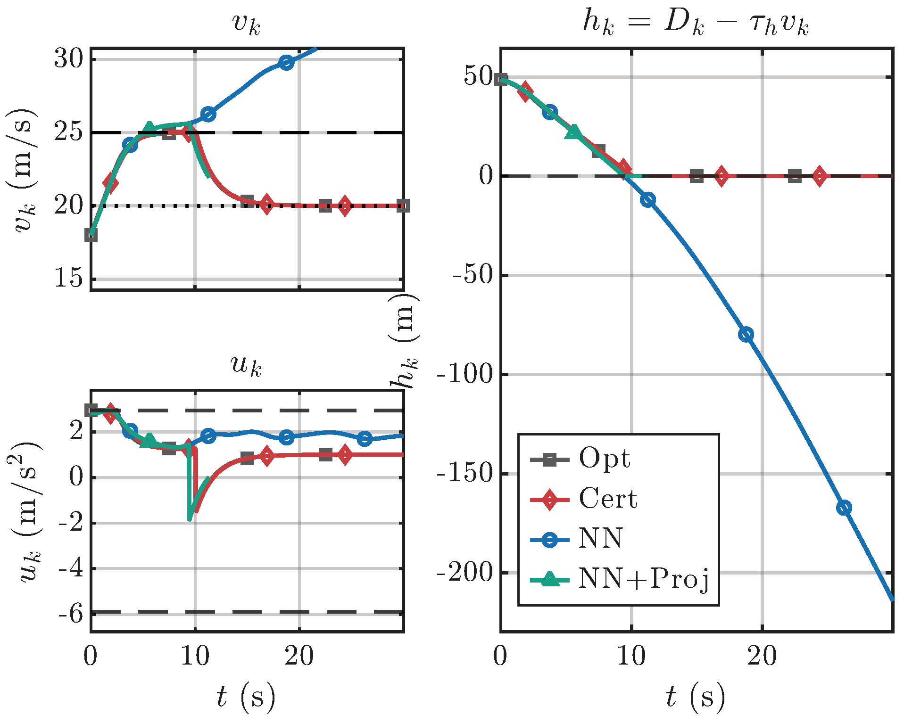

# CertNet Control Simulation Release

This repository provides a MATLAB evaluation package for the accompanying manuscript:

**Provably Constraint-Satisfying Low-Latency Control via Structural Decoupling of Feasibility and Performance**

The manuscript is currently under review. This repository is provided to support reproducibility of the reported experiments.

The repository focuses on reproducing the reported evaluation results from released artifacts. It contains pre-synthesized certified libraries, trained controllers, baseline artifacts, compiled MEX evaluators, MATLAB live scripts, and PDF/PNG figures associated with the reported experiments.

The key idea of CertNet is to decouple hard feasibility from performance learning. Hard feasibility is enforced by a certified geometric executor, while learning is used only to select coefficients within the certified feasible family. Online execution avoids iterative optimization and projection inside CertNet; it reduces to candidate query, learned coefficient generation, and algebraic reconstruction.

---

## Repository Contents

```text
.
├─ Cert/
│  ├─ @Cert/
│  │  └─ Cert.m
│  └─ api/
│     ├─ api_build_mex_.m
│     └─ api_cover_/
│        ├─ cover_build_model_.m
│        ├─ cover_filter_rows_.m
│        ├─ cover_reduce_active_by_data_.m
│        ├─ cover_select_add_law_.m
│        └─ cover_solve_mip_.m
│
├─ cert_policy_mex.mexw64
├─ nn_policy_mex.mexw64
├─ pwa_policy_mex.mexw64
│
├─ demo_Regions_release_pack.mat
├─ demo_mpqp_release_pack.mat
├─ demo_CA_release_pack.mat
├─ demo_ACC_release_pack.mat
│
├─ demo_regions_.mlx
├─ demo_mpqp_.mlx
├─ demo_ca_.mlx
├─ demo_acc_.mlx
│
├─ sim_region_compare.pdf
├─ sim_region_compare.png
├─ sim_mpQP.pdf
├─ sim_mpQP.png
├─ sim_CA.pdf
├─ sim_CA.png
├─ sim_ACC.pdf
├─ sim_ACC.png
│
├─ LICENSE
└─ README.md
```

---

## Important Release Note

This repository is an **evaluation/reproduction release**, not a full from-scratch training and synthesis release.

The `.mat` release packs contain the already generated experiment artifacts, including the certified executor objects, trained controllers, baseline data, and evaluation data needed by the demo scripts. The released live scripts load these saved artifacts and reproduce the reported evaluation protocol, figures, and summary statistics.

The full offline generation pipeline used to synthesize every certified library and train every controller from scratch is not included in this release. Therefore, the intended use of this repository is:

1. load the released experiment packs;
2. run the corresponding MATLAB live scripts;
3. reproduce the reported figures and evaluation metrics;
4. inspect the deployed CertNet executor and baseline behavior.

---

## Quick Start

1. Clone or download this repository.
2. Open MATLAB.
3. Set the current MATLAB folder to the repository root.
4. Add the repository to the MATLAB path:

```matlab
addpath(genpath(pwd));
```

5. Run the live scripts:

```matlab
open("demo_regions_.mlx")
open("demo_mpqp_.mlx")
open("demo_ca_.mlx")
open("demo_acc_.mlx")
```

Each script loads its corresponding release pack:

| Script | Release pack | Purpose |
|---|---|---|
| `demo_regions_.mlx` | `demo_Regions_release_pack.mat` | PWA partition vs. certified active validity-region cover |
| `demo_mpqp_.mlx` | `demo_mpqp_release_pack.mat` | Unbounded mpQP benchmark evaluation |
| `demo_ca_.mlx` | `demo_CA_release_pack.mat` | Control allocation closed-loop evaluation |
| `demo_acc_.mlx` | `demo_ACC_release_pack.mat` | Adaptive cruise control safety-filter evaluation |

---

## Tested Environment

The release was prepared and tested in a Windows MATLAB environment.

- **OS:** Windows 11
- **MATLAB:** R2025a
- **Solvers/Libraries used in the experiments:** MOSEK, YALMIP, MPT3
- **Compiled evaluators:** Windows 64-bit MEX files (`*.mexw64`)

The included MEX files are Windows 64-bit binaries. On non-Windows platforms, these binaries will not run directly. Recompilation or a MATLAB fallback implementation would be required for non-Windows use.

MOSEK requires a valid license if the scripts call solver-dependent baseline or projection routines.

---

## Figures

The repository includes paper-ready PDF figures and PNG previews for GitHub visualization.

| PDF figure | PNG preview | Description |
|---|---|---|
| [`sim_region_compare.pdf`](sim_region_compare.pdf) | [`sim_region_compare.png`](sim_region_compare.png) | PWA critical-region partition vs. certified active validity-region cover |
| [`sim_mpQP.pdf`](sim_mpQP.pdf) | [`sim_mpQP.png`](sim_mpQP.png) | mpQP benchmark timing and hard-feasibility diagnostics |
| [`sim_CA.pdf`](sim_CA.pdf) | [`sim_CA.png`](sim_CA.png) | Control allocation closed-loop trajectories under deadline-limited execution |
| [`sim_ACC.pdf`](sim_ACC.pdf) | [`sim_ACC.png`](sim_ACC.png) | ACC closed-loop speed, input, and safety-margin trajectories |

The PNG files are shown once in the corresponding experiment sections below. The PDF files are retained as paper-ready versions.

---

## Method Summary

For each hard-constrained interface

```math
\mathcal U(\xi)=\{u\mid S\xi+Gu\le b\},
```

CertNet constructs a certified deployable family of the form

```math
u_\theta(\xi,\eta)
=
V(\xi)\lambda_\theta(\xi,\eta)
+
R\rho_\theta(\xi,\eta),
```

where:

- `V(xi)` is the queried matrix of certified feasible candidates;
- `R` contains fixed recession directions satisfying `G R <= 0`;
- `lambda_theta` lies on the simplex;
- `rho_theta` is nonnegative.

Thus, feasibility follows structurally from the certified family, rather than from online optimization, online projection, or post-hoc repair.

The learned proposer only controls the coefficients inside the certified feasible family. Therefore, approximation error may affect performance recovery, but not the hard-feasibility guarantee of the certified executor.

---

## 1. PWA Partition vs. Feasibility-Certified Active Cover

The region-comparison demo illustrates the central feasibility-performance decoupling mechanism.

A standard strictly convex mpQP constructs an explicit PWA optimizer by partitioning the parameter domain according to both hard constraints and objective-dependent KKT optimality conditions. In contrast, CertNet resolves only the hard-constraint-induced vertex-ray structure and learns the performance-dependent coefficient selection within the certified feasible family.

The figure compares these two representations on a two-dimensional unbounded hard-constrained example, shown on a bounded plotting window. The left panel shows the explicit mpQP critical-region partition. The right panel shows the certified active validity-region cover generated by the active library, where the color indicates the number of queried active candidates.



PDF version: [`sim_region_compare.pdf`](sim_region_compare.pdf)

In this example:

- the explicit mpQP solution contains **52** critical regions;
- **38** of these regions intersect the bounded plotting window;
- CertNet compiles **71** Full-library feasibility candidates;
- CertNet deploys only **23** active candidates.

This comparison highlights the intended distinction: explicit mpQP represents the objective-induced optimizer partition, whereas CertNet represents a feasibility-certified active cover and leaves performance recovery to coefficient selection inside the certified family. Therefore, the deployed active cover can reduce the structural burden without reconstructing the full objective-induced PWA partition.

Run:

```matlab
open("demo_regions_.mlx")
```

---

## 2. Unbounded mpQP Benchmarks

The mpQP benchmark contains two unbounded hard-constrained instances. Each instance is evaluated against a feasible QP teacher.

Compared methods:

- **QP:** online optimization teacher;
- **PWA:** explicit solution when available;
- **PureNN:** unconstrained neural policy;
- **NN+Proj:** neural policy followed by projection when needed;
- **CertNet:** certified executor with learned coefficient selection.

The figure reports the latency-feasibility behavior of all methods. The timing panels summarize mean, median, and p99 runtime, while the violation-CDF panels show the hard-constraint residual distribution relative to the numerical feasibility tolerance. This directly evaluates whether low runtime is obtained without losing hard-interface feasibility.



PDF version: [`sim_mpQP.pdf`](sim_mpQP.pdf)

Run:

```matlab
open("demo_mpqp_.mlx")
```

### mpQP Headline Results

Timing is reported in microseconds. Violation rate is measured with respect to the hard-interface residual above the numerical feasibility tolerance.

| Setting | Method | Mean runtime | p99 runtime | Mean speedup | Hard-feasibility violation rate | Mean `u`-MSE |
|---|---:|---:|---:|---:|---:|---:|
| S1 | QP | 1188.92 | 1626.65 | 1.00x | 0.00% | --- |
| S1 | PWA | 477.95 | 612.65 | 2.49x | 0.00% | 7.81e-11 |
| S1 | PureNN | 8.59 | 16.00 | 138.39x | 30.78% | 2.94e-2 |
| S1 | NN+Proj | 295.27 | 1218.35 | 4.03x | 0.00% | 2.82e-2 |
| S1 | **CertNet** | **33.02** | **66.20** | **36.01x** | **0.00%** | **2.50e-2** |
| S2 | QP | 1247.93 | 1612.85 | 1.00x | 0.00% | --- |
| S2 | PureNN | 9.87 | 17.15 | 126.46x | 50.82% | 4.16e-2 |
| S2 | NN+Proj | 477.67 | 1165.95 | 2.61x | 0.00% | 3.90e-2 |
| S2 | **CertNet** | **46.41** | **85.20** | **26.89x** | **0.00%** | **3.34e-2** |

For NN+Proj, the projection-use rates are **30.84%** in S1 and **50.96%** in S2. This explains the increased mean and tail runtime compared with the raw neural predictor.

### Offline Representation Scale

| Setting | Dimensions `(n_u,n_xi,n_eta)` | Hard/soft inequalities `(m_H,m_S)` | PWA regions | Active/Full library |
|---|---:|---:|---:|---:|
| S1 | `(3,2,1)` | `(18,30)` | 12091 | 75 / 236 |
| S2 | `(3,6,2)` | `(33,40)` | timeout | 436 / 1935 |

S1 shows that the certified active library can be much smaller than the explicit objective-induced PWA partition. S2 shows that explicit PWA compilation may become unavailable under the same practical offline budget, while the certified active library remains deployable.

The mpQP results show the separation among the methods. PureNN is fast but not reliable under hard constraints. NN+Proj restores feasibility through online projection, but this repair increases runtime, especially in the tail. CertNet preserves hard-interface feasibility while avoiding both online QP solving and online projection.

---

## 3. Control Allocation Benchmark

The control allocation benchmark evaluates deadline-aware closed-loop deployment.

At each step, the controller must finish within the sampling budget. If a method exceeds the deadline, the system applies a zero-increment hold action. Therefore, runtime tails directly affect the closed-loop trajectory.

Compared methods:

- **Opt:** online optimization teacher;
- **PureNN:** unconstrained neural policy;
- **NN+Proj:** neural policy with projection repair;
- **CertNet:** certified executor.

The figure shows the closed-loop behavior under this deadline-enforced execution rule. It is designed to test not only raw controller quality, but also whether runtime tails and deadline misses propagate into closed-loop degradation.



PDF version: [`sim_CA.pdf`](sim_CA.pdf)

Run:

```matlab
open("demo_ca_.mlx")
```

### CA Headline Results

Sampling deadline:

```text
T_s = 1000 microseconds
```

| Method | Mean runtime | p99 runtime | Mean speedup | Hard-feasibility violation rate | Deadline miss rate | `w`RMSE |
|---|---:|---:|---:|---:|---:|---:|
| Opt | 1006.3 | 2027.4 | 1.00x | 0.00% | 26.00% | 2.098e-1 |
| PureNN | 10.1 | 32.2 | 99.97x | 48.60% | 0.00% | 3.097e-1 |
| NN+Proj | 387.2 | 1885.3 | 2.60x | 0.00% | 10.40% | 3.222e-1 |
| **CertNet** | **63.3** | **185.8** | **15.89x** | **0.00%** | **0.00%** | **4.231e-2** |

The CA benchmark shows three different deployment behaviors. Opt provides the teacher labels but can miss deadlines. PureNN is fast but violates the hard interface. NN+Proj restores feasibility but reintroduces expensive projection and tail latency. CertNet avoids both hard-interface violations and deadline misses while achieving the best deployed tracking metric in this experiment.

The released CA artifacts use:

```text
N_train = 20000
N_test  = 500
n_LFull = 4096
n_LAct  = 353
```

---

## 4. Adaptive Cruise Control Benchmark

The ACC benchmark evaluates CLF/CBF-style safety-filter recovery.

The hard interface includes input bounds, safety constraints, and one-step state bounds. Runtime is measured for deployment comparison, but it is not injected into the state update. Thus, the rollout evaluates controller quality and safety, while the timing results quantify computational cost.

Compared methods:

- **Opt:** online CLF/CBF-style optimization teacher;
- **PureNN:** unconstrained neural policy;
- **NN+Proj:** neural policy with projection repair;
- **CertNet:** certified executor.

The figure shows closed-loop speed, input, and safety-margin behavior. This benchmark tests whether the certified executor can recover the behavior of a safety-filtering teacher while keeping the online path non-iterative and low-latency.



PDF version: [`sim_ACC.pdf`](sim_ACC.pdf)

Run:

```matlab
open("demo_acc_.mlx")
```

### ACC Headline Results

| Method | Mean runtime | p99 runtime | Mean speedup | Hard-feasibility violation rate | Rollout status | Cost |
|---|---:|---:|---:|---:|---:|---:|
| Opt | 805.0 | 1286.0 | 1.00x | 0.00% | safe | 1.648e1 |
| PureNN | 8.9 | 21.2 | 90.29x | 70.00% | unsafe | N/A |
| NN+Proj | 173.8 | 1054.4 | 4.63x | 0.07% | stop 568/1500 | N/A |
| **CertNet** | **24.7** | **56.3** | **32.60x** | **0.00%** | **safe** | **1.651e1** |

PureNN is fast but unsafe in closed-loop rollout. NN+Proj repairs many infeasible neural outputs, but the projection routine becomes a runtime and robustness bottleneck and stops at step `568/1500`. CertNet follows Opt-like safe behavior while avoiding online projection and substantially reducing both mean and tail runtime.

The released ACC artifacts use:

```text
N_train = 20000
N_test  = 1500
n_LFull = 5
n_LAct  = 4
```

---

## At-a-Glance Summary

| Benchmark | CertNet mean runtime | CertNet p99 runtime | Speedup vs. optimization | Hard-feasibility violation rate | Main deployment outcome |
|---|---:|---:|---:|---:|---|
| mpQP S1 | 33.02 us | 66.20 us | 36.01x vs QP | 0.00% | Fast certified evaluation |
| mpQP S2 | 46.41 us | 85.20 us | 26.89x vs QP | 0.00% | PWA compilation times out, CertNet remains deployable |
| CA | 63.3 us | 185.8 us | 15.89x vs Opt | 0.00% | Zero deadline misses under `T_s=1000 us` |
| ACC | 24.7 us | 56.3 us | 32.60x vs Opt | 0.00% | Safe finite rollout with Opt-like behavior |

---

## Notes on Timing and Feasibility Metrics

- Timings exclude one-time setup overhead.
- Timing statistics are steady-state evaluation times.
- Mean and p99 are reported to reflect both average runtime and tail behavior.
- Hard-feasibility violation rate is computed using the numerical feasibility threshold used in the experiments.
- A reported `0.00%` violation rate means zero observed violations above the prescribed numerical tolerance in the evaluated samples or rollout.
- For NN+Proj, the projection-use rate is reported separately because projection calls explain much of its runtime tail.

---

## Reproducibility Scope

This repository supports reproduction of the released evaluation artifacts:

- loading trained/released controllers;
- evaluating CertNet and baselines;
- reproducing timing, feasibility, and closed-loop metrics;
- regenerating the provided paper figures.

This repository does not claim to provide a complete from-scratch rebuild of every controller, library, and training run from raw random seeds. The included release packs are the intended reproduction interface.

---

## Citation

The manuscript is currently under review. A formal citation will be added after publication.

---

## License

This project is released under the license included in this repository. See [`LICENSE`](LICENSE`.

---

## Contact

For questions, please open a GitHub issue or contact the authors.
